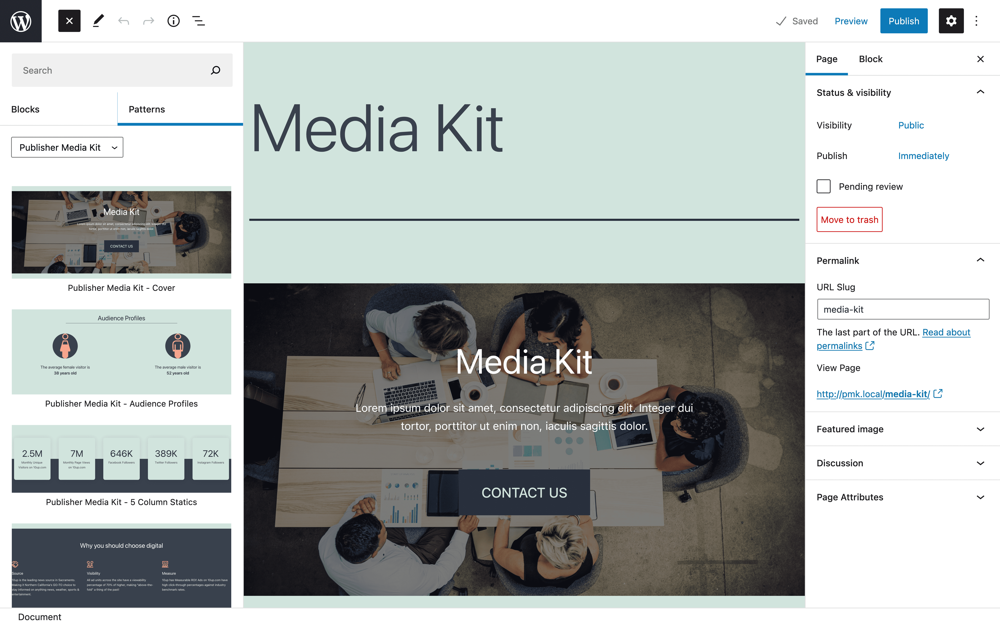
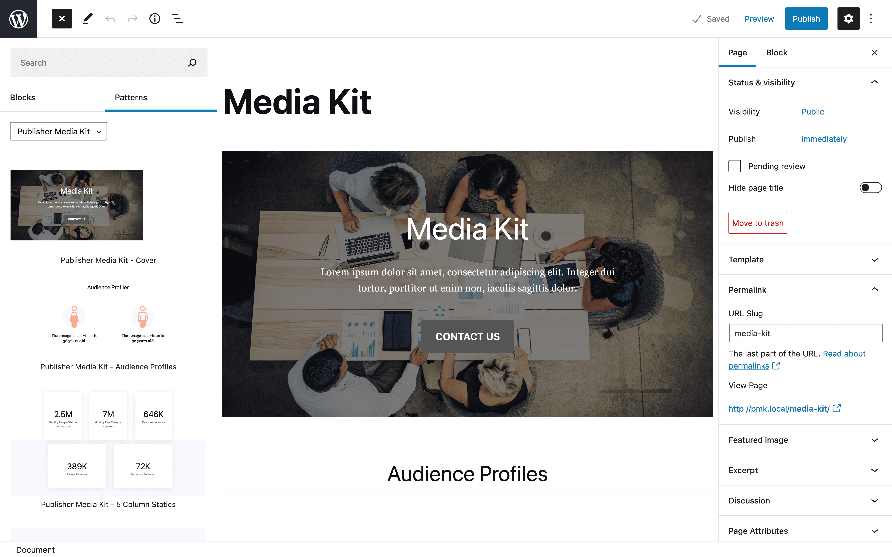

# Publisher Media Kit

> Pre-configured Media Kit Page using Gutenberg Block Patterns.

      

## Overview

Publisher Media Kit provides a quick and easy option for small to medium sized publishers to digitize their media kit.  If you are a publisher hoping for a page like the [NY Times' Advertising Standard Units](https://nytmediakit.com/standard-units), but do not have a designer or developer on staff?  Then this plugin is for you.  If you are still using a print or PDF version of your media kit to sell space on your website, but want show advertisers looking to buy digital real estate that you are a digital-forward partner?  Then this plugin is for you.

Twenty Twenty One default theme | Newspack base theme
------------- | -----------------
 | 

The plugin adds a new "Media Kit" page, block patterns, and placeholder content that can then be customized to fit your need (e.g., text, links, colors, images, adding page link to site footer).

Twenty Twenty One default theme | Newspack base theme
------------- | -----------------
 | 

## Requirements

* PHP Requires: 7.4
* WordPress Requires at least: 5.7

## Theme Compatibility

We have tested the plugin with the following WordPress themes and have validated that the resulting `Media Kit` page renders as expected on the front-end and within the block editor.  Please [open an issue](https://github.com/10up/publisher-media-kit/issues/new/choose) if you find an issue with any of these themes or have an alternate, public theme with a conflict that we can help resolve.

1. [Twenty Twenty-One](https://wordpress.org/themes/twentytwentyone/)
1. [Newspack base theme](https://github.com/Automattic/newspack-theme)
1. [Newspack: Joseph](https://github.com/Automattic/newspack-theme)
1. [Newspack: Katharine](https://github.com/Automattic/newspack-theme)
1. [Newspack: Nelson](https://github.com/Automattic/newspack-theme)
1. [Newspack: Sacha](https://github.com/Automattic/newspack-theme)
1. [Newspack: Scott](https://github.com/Automattic/newspack-theme)

## Installation

1. Install the plugin via the plugin installer, either by searching for it or uploading a .ZIP file.
1. Activate the plugin.
1. Open the "Media Kit" page, edit the content to your needs, and hit publish!

## Frequently Asked Questions

### I accidentally deleted a block from my `Media Kit` page, how do I add it back?

Click the block inserter (`+` button) in the top left of the block editor, click the `Patterns` tab, select `Publisher Media Kit` in the dropdown, and select the specific Block Pattern that you want to add back to your page.

### I want to add block from my `Media Kit` page on a different post/page, how do I add it outside the `Media Kit` page?

Click the block inserter (`+` button) in the top left of the block editor, click the `Patterns` tab, select `Publisher Media Kit` in the dropdown, and select the specific Block Pattern that you want to add to your post/page.

## Support Level

**Stable:** 10up is not planning to develop any new features for this, but will still respond to bug reports and security concerns. We welcome PRs, but any that include new features should be small and easy to integrate and should not include breaking changes. We otherwise intend to keep this tested up to the most recent version of WordPress.

## Changelog

A complete listing of all notable changes to Publisher Media Kit are documented in [CHANGELOG.md](https://github.com/10up/publisher-media-kit/blob/develop/CHANGELOG.md).

## Contributing

Please read [CODE_OF_CONDUCT.md](https://github.com/10up/publisher-media-kit/blob/develop/CODE_OF_CONDUCT.md) for details on our code of conduct, [CONTRIBUTING.md](https://github.com/10up/publisher-media-kit/blob/develop/CONTRIBUTING.md) for details on the process for submitting pull requests to us, and [CREDITS.md](https://github.com/10up/publisher-media-kit/blob/develop/CREDITS.md) for a listing of maintainers of, contributors to, and libraries used by Publisher Media Kit.

## Like what you see?

